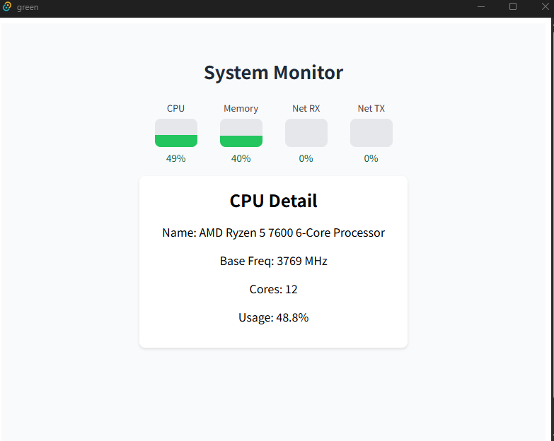

# Tauri + React + Typescript

This template should help get you started developing with Tauri, React and Typescript in Vite.

# build Environment Setup

```powershell
./setup-tauri.ps1
```

# run

```powershell
pnpm tauri dev
```

# example image


